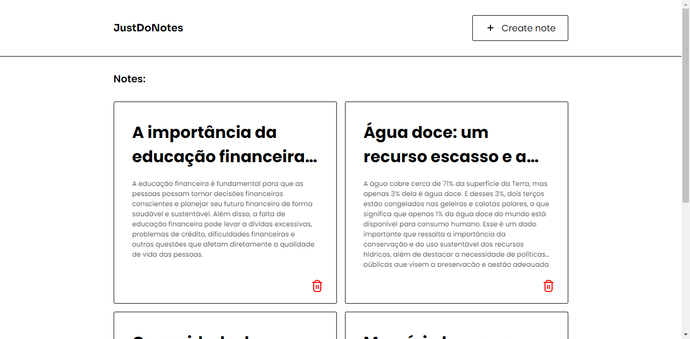

# 

Registre suas ideias geniais, planeje sua semana ou simplesmente faça listas de tarefas em um piscar de olhos.

## Screenshots

## Tech Stack

- HTML
- CSS
- JavaScript

🔗 [Clique aqui](https://matheusfdosan.github.io/justdonotes/) para ver o projeto.

## Características

- Salva as notas no localStorage
- Responsividade
- Layout Simples

## Color Reference

| Color | Hex                                                              |
| ----- | ---------------------------------------------------------------- |
| Black |  #000000    |
| White |  #ffffff    |

## Reconhecimentos

- [Icons8](https://icons8.com.br/)
- [Flaticon](https://www.flaticon.com/br/uicons/interface-icons)
- [MDN](https://developer.mozilla.org/en-US/)

## 🔗 Links

